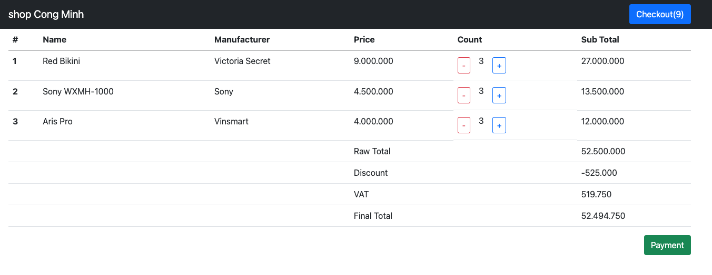
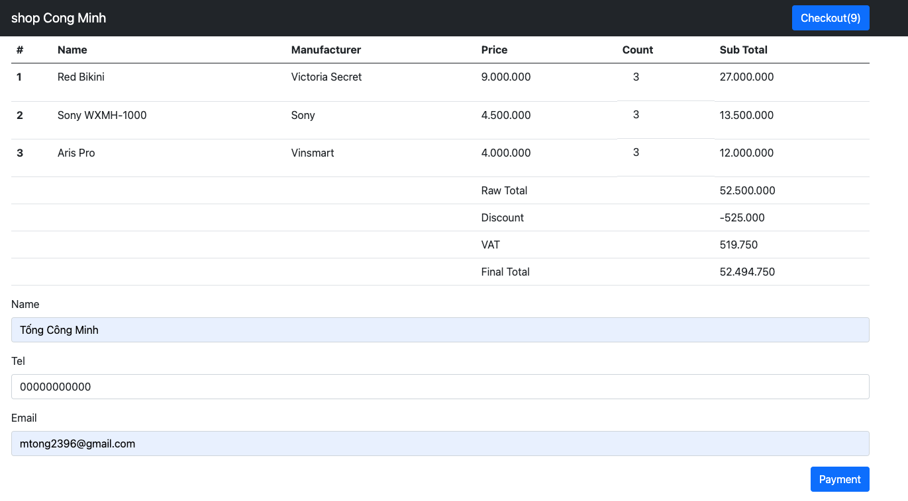
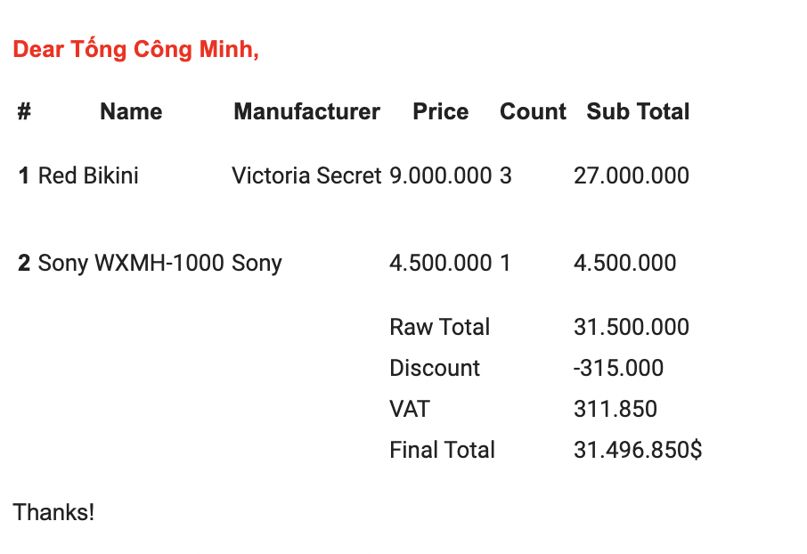

# Lab15. ShoppingCart

## Setup project:
1. Mở MySql và chạy file `session_schema.sql`
2. Trong phần `Security` của email bật `Less secure app access`
3. Điền thông tin tài khoản mysql (nếu có) vào `application.properties`
4. Thay đổi thông tin email gửi đi trong `constant/MyConstants.java`

### Màn hình checkout:

### Màn hình payment:

### Màn hình email nhận được:
